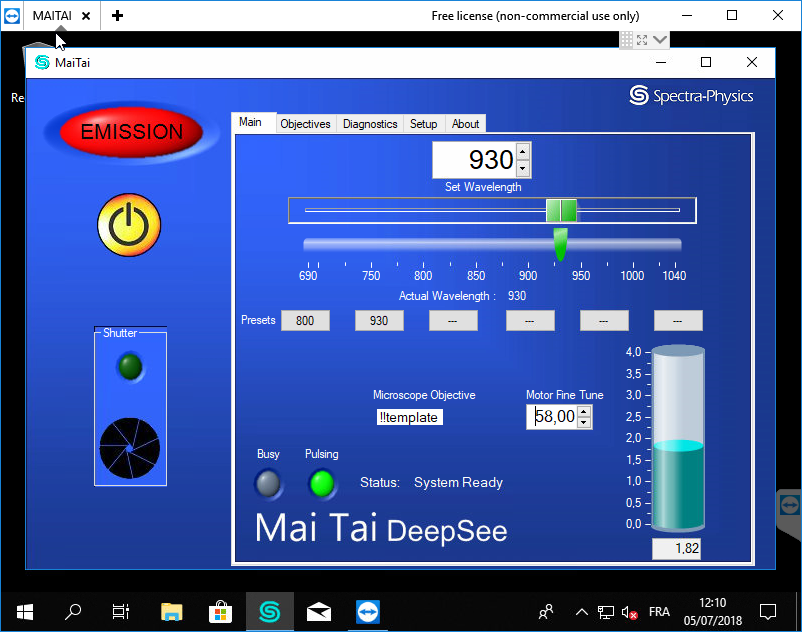
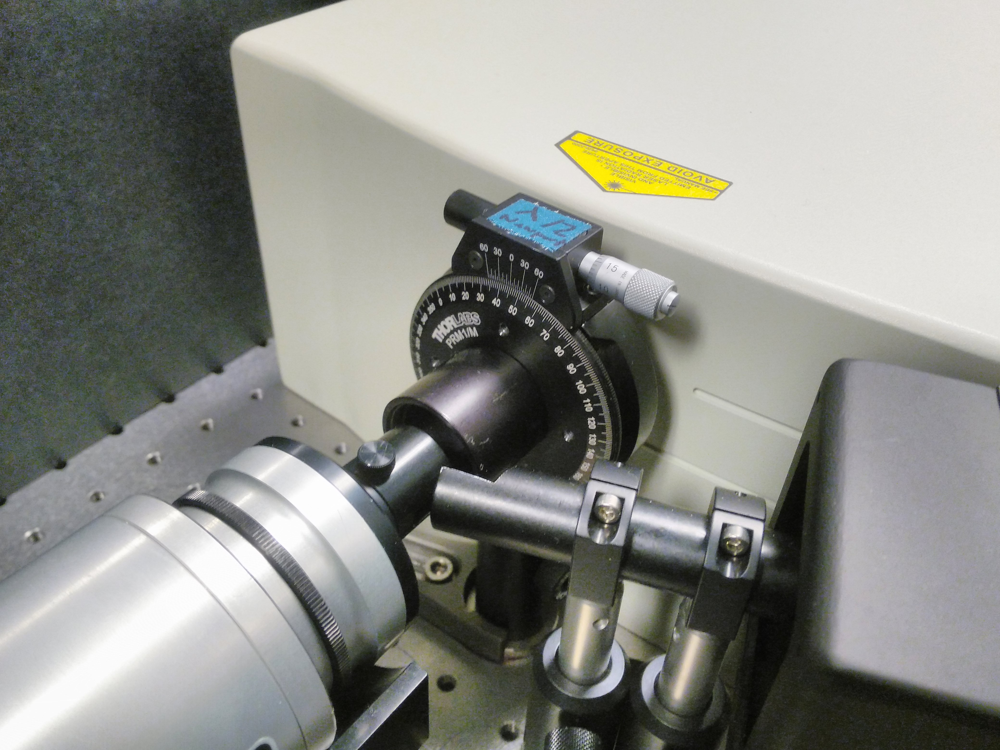
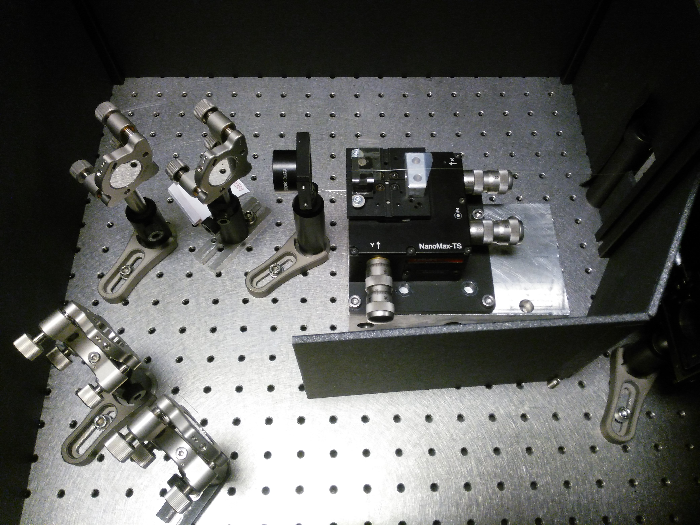
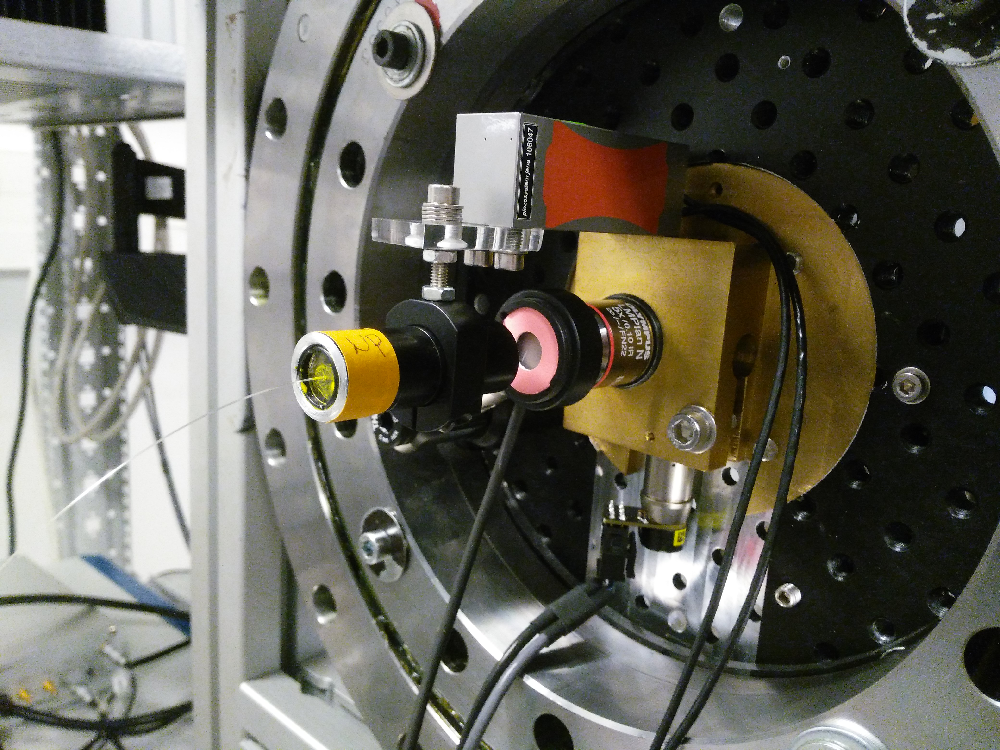

# RLS2P

"rotating light sheet two photons"

## Démarrer le laser

1. se connecter via teamviewer au contrôleur du laser
2. appuyer trois secondes sur le bouton de marche
3. régler la longueur d'onde sur 930 nm
4. quand "busy" s'éteind, régler "motor fine tune" sur 58

1. régler la lame lambda/2 à 45° pour travailler à faible puissance
2. mettre les lunettes
3. appuyer trois secondes sur le bouton "shutter"

## Injection dans la fibre

1. placer un puissancemètre en sortie de fibre
2. ajuster finement les réglages y et z en entrée de fibre pour maximiser la puissance en sortie

## Scanner

prgm lightsheet

prefdir C:\Users\LJP\AppData\Roaming\MathWorks\MATLAB\R2018a
Lightsheet_Config.txt