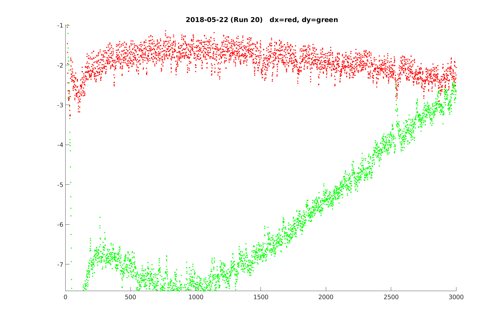
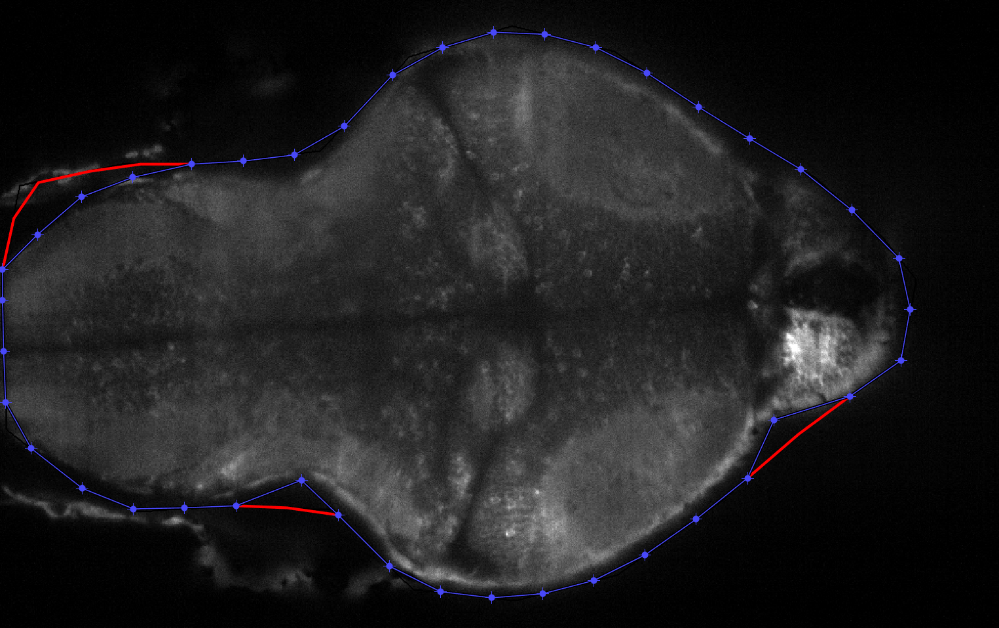
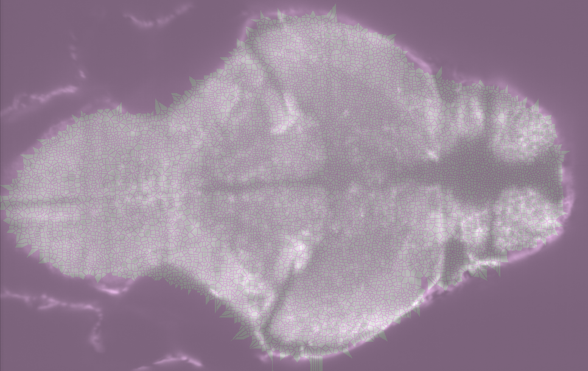
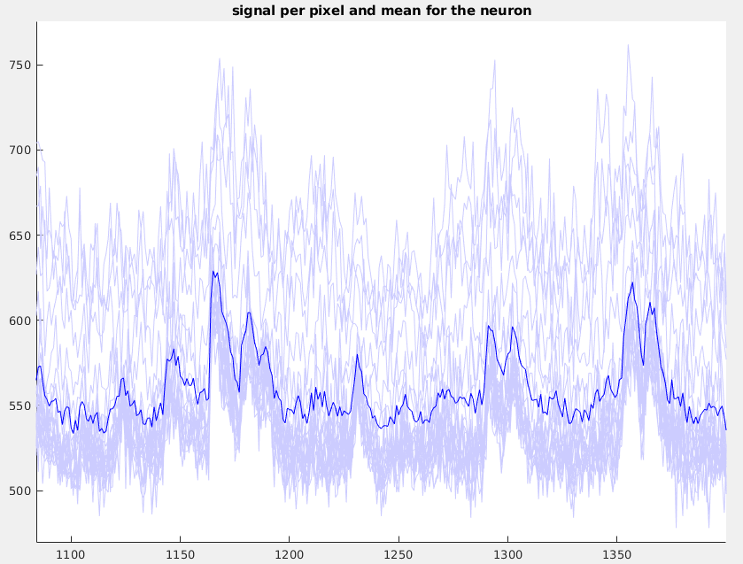
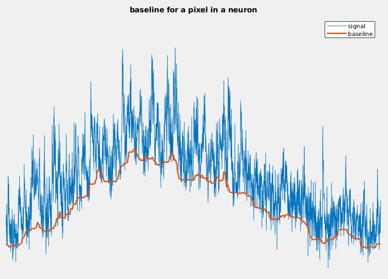
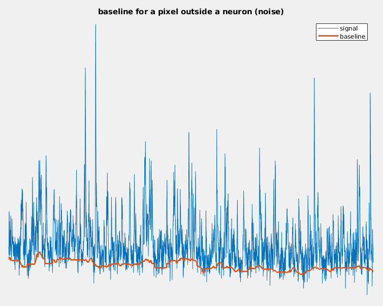
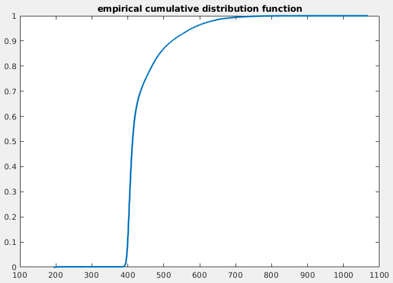
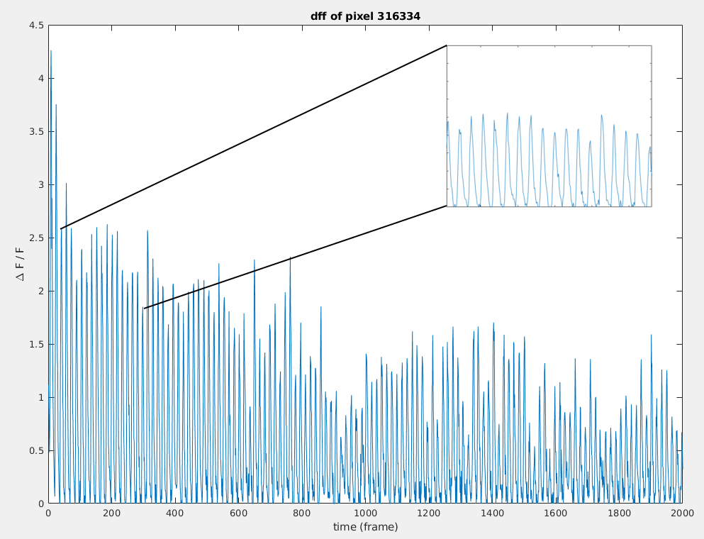
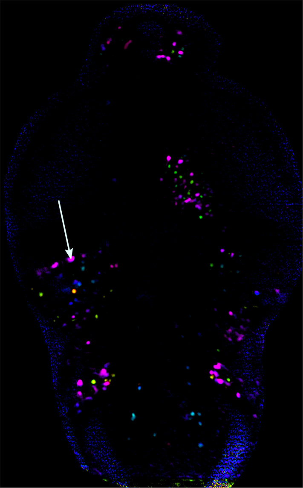

# General functioning

"easyRLS" is intended to provide a stable and efficient code base for computations on calcium imaging data. It can be run both as a step by step script and a workflow.

## Main processing steps
- drift correction
- mapping to reference brain
- neuron segmentation
- baseline computation
- DFF computation

### Drift correction

The (x,y) drift correction is achieved by cross correlation of each layer with a reference layer. Pseudocode equivalent of the current processing steps :
1. take a reference stack (for example the 10th stack)
2. compute the maximum along z of a region of precised layers (the region avoids the eyes and the layers are in the middle), this will be the reference image
3. for each time, do the same operations on a stack, this will be the moving image
4. do the 2D cross correlation between the reference and the moving image. The maximum gives you the dx and dy

It also a plot of the dx and dy which looks like this :

### Finding the ROI

Currently, the region of interest is found base on the intensity level, and a graphical interface lets you adjust it by hand.

### Mapping to the reference brain

### Neuron segmentation

The segmentation uses a watershed algorithm. The result looks like this (pink is outside segmentation):

When doing the mean of the pixel's signals on a neuron, we get something like this :

### Baseline computation

The baseline is defined as the 10th percentile of the signal over a certain time window. The computation is achieved thanks to a running quantile algorithm.

TODO: [runquantile](https://www.rdocumentation.org/packages/caTools/versions/1.17.1/topics/runquantile)

The result given looks like this :

### Background computation

The background is computed by a custom function (see NeuroTools) by taking the limit in the ecdf (see image below).

### DFF computation

The DFF is computed with the formula :

### Phasemap computation

For a sinus stimulus, we compute a "phasemap" as follows:

Example of the dff for a pixel in a neuron which has a strong response :

We compute the dff discrete Fourier Transform (fft algorithm) for each pixel.

Example for the pixel above :

Then we take the complex value of the signal at the stimulus frequency and the mean absolute value on an arbitrary window around.

Here the peak value is $r e^{i \varphi}$ with r = 577.5905 and phi = 2.1885. For the phasemap, we plot for each pixel a color phi with an amplitude
$$
A = \frac{\text{signal}-\text{noise}}{\text{noise}}
$$

The arrow point the pixel presented above.

[see video](./img/neuron_sinus.webm)

<video src="./img/neuron_sinus.webm" autoplay></video>

