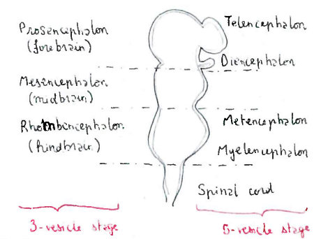
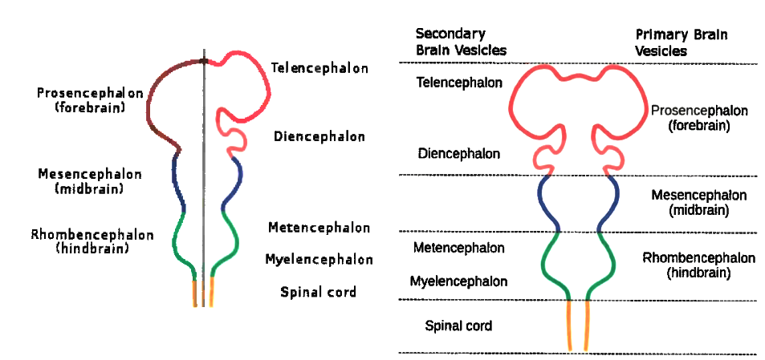
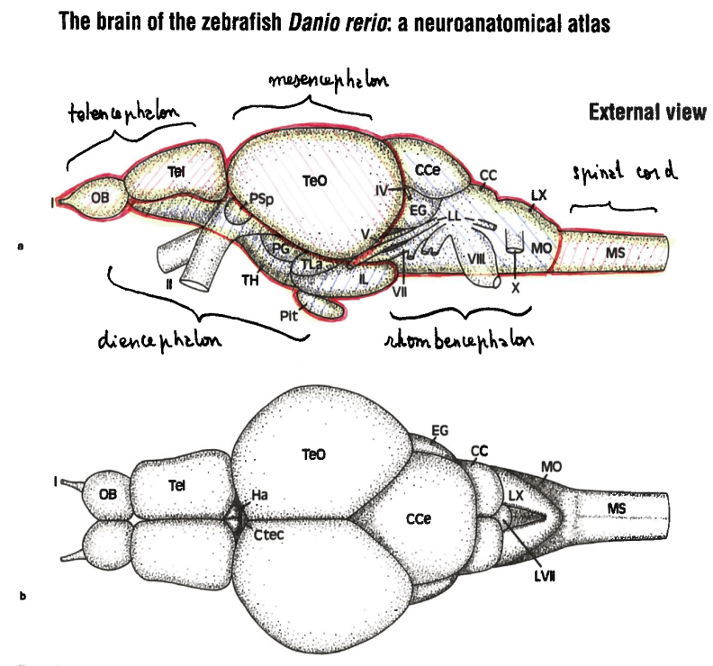

# Brain morphology

## Early development of the central nervous system

- Forebrain
  - Telencephalon
    - cerebral cortex (memory, attention, perception, cognition, awareness)
    - hippocampus (short-term, long-term, spatial memory)
    - basal ganglia (voluntary motor movements, procedural learning, eye movement)
    - olfactory bulb (olfaction)
  - diencephalon
    - thalamus (relaying sensory and motor signals to cortex, sleep and consciousness regulation)
    - hypothalamus (links the nervous system to the endocrine system (hypophyse))
    - subthalamus (interpretation of somatic motor functions)
    - epithalamus (connects limbic system to other parts of the brain)
    - pretectum (visual reflexes, mediates motosensory and perceptive information)
  - Midbrain
    - tectum (reflex actions with visual or auditory stimuli)
    - cerebral acqueduct
    - tegmentum (maintaining of posture and volontary movements)
    - basis pedunculi (refining motor movements, learning new motor skills)
  - Hindbrain
    - metencephalon
      - ...
      - cerebellum (motor control, cognitive functions (attention, language))
    - myelencephalon (automatic functions)

- **CC**           crista cerebellaris
- **CCe**          corpus cerebelli
- **Ctec**         commissura granularis
- **EG**           eminentia granularis
- **Ha**           habenula
- **IL**            inferior loba of hypothalamus
- **LL**           lateral line nerves
- **LVII**         facuak kibe
- **LX**           vagal lobe
- **MO**           medulla oblongata
- **MS**           medulla spinalis
- **OB**           olfactory bulb
- **PG**           preglomerular area
- **Pit**          pituitary
- **PSp**          parvocellular superficial pretectal nucleus
- **Tel**          telencephalon
- **TeO**          tectum opticum
- **TH**           tuberal hypotalamus
- **TLa**          torus lateralis
- **I**            olfactory nerve
- **II**           optic nerve
- **IV**           trochlear nerve
- **V**            trigeminal nerve
- **VII**          facial nerve
- **VIII**         octaval nerve
- **X**            vagal nerve

#### Nucleus

A nucleus is a cluster of neurons in the central nervous system located deep within the cerebral hemispheres and brainstem. The neurons in one nucleus usually have roughly similar connections and functions. Nuclei are one of the two most common forms of nerve cell organization, with layered structures such as the cerebral cortex. Gray matter, often bordered with white matter. A nucleus in the periphenal nervous system is called a ganglion.